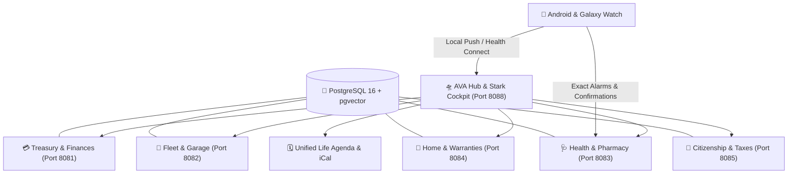

<div align="center">

# 🛸 AVA NEXUS // Living Aurora
### *Autonomous Virtual Assistant & Personal Life ERP*

[](LICENSE)
[](https://python.org)
[](https://fastapi.tiangolo.com)
[](https://docker.com)
[](apps/mobile)
[](https://tailwindcss.com)
[-3DDC84.svg?style=flat-square&logo=android)](https://github.com/aa-stop-run/AVA-Nexus/releases/download/v1.0.0/ava-mobile.apk)

**A 100% self-hosted, privacy-first, modular homelab ecosystem designed to manage your finances, fleet, health, unified life agenda, home warranties, citizenship deadlines, and proactive daily briefing.**

[Features](#-key-verticals) • [Unified Life Agenda](#-unified-life-agenda--calendar-engine) • [Architecture](#-architecture) • [Quickstart](#-quickstart) • [Mobile Companion](#-android--galaxy-watch-app) • [Modular Ingestion](#-modular-ingestion-options) • [Contributing](#-contributing)

</div>

---

## 🌟 Vision & Design Philosophy

AVA Nexus is built on three core pillars:
1. **Absolute Privacy & Zero Third-Party Cloud Lock-in**: All biometric data, bank records, and identity files remain on your local server.
2. **Ironclad Offline Resilience**: Powered by an internal **Circuit Breaker**. If external LLM engines (e.g. Ollama, LiteLLM) are offline or degraded, AVA instantly switches to an Autonomous Deterministic Engine (< 10ms response time).
3. **Executive Sci-Fi Aesthetics**: An immersive **Living Aurora & Stark HUD Cockpit** with 3D canvas orb animation, real-time telemetry, multi-user PIN security lockscreen, and voice synthesis.

---

## 🚀 Key Verticals



### 1. 🛸 AVA Hub & Executive Cockpit (`:8088`)
* **Stark HUD & 3D Living Aurora**: Interactive orb visualizing system health, weather radar, and action logs.
* **Proactive Radar Engine**: Aggregates upcoming deadlines across all domains into prioritized action cards.
* **Multi-User PIN Lockscreen**: Instant PIN switching (`aa-stop-run` / `Member`) with session cookies and auto-logout.
* **Voice Briefing (TTS/STT)**: High-quality offline speech synthesis with daily executive briefings.

### 2. 🗓️ Unified Life Agenda & Calendar Engine
* **Multi-Domain Timeline Aggregator**: Automatically unifies events across all life verticals into a single interactive calendar.
* **NLP Voice/Chat Scheduling**: Add complex appointments using natural language voice or text commands:
  * *"Schedule pediatric appointment for Junior on Sep 15 at 10:30 at Central Clinic with Dr. Sofia"*
  * *"Book family dinner on Aug 28 at 20:00 at Harbor Restaurant"*
* **Live RFC 5545 Webcal Feed (`/api/hub/agenda/feed.ics`)**: Subscribe to your live, self-hosted unified life schedule directly from Apple Calendar, Google Calendar, Outlook, or Thunderbird.
* **Color-Coded Timeline**: Visual dot indicators for each life domain (Rose = Health, Amber = Vehicles/Inspections, Emerald = Finances/Loans, Cyan = Personal/Family).

### 3. 💳 Treasury & Personal Finances (`:8081`)
* **90-Day Cash Flow Projection**: Daily liquidity balance forecasting including scheduled recurring expenses.
* **Multi-Bank Management**: Universal statement importer supporting **CSV, OFX, and JSON** formats.
* **Loan & Mortgage Simulators**: Fixed/mixed rate amortization schedules and early repayment calculators.
* **Subscription & Fixed Cost Radar**: Automated categorization and recurring payment tracking.

### 4. 🚗 Fleet, Fuel & Inspection Garage (`:8082`)
* **Multi-Vehicle Registry**: Car and motorcycle dossiers, odometer tracking, and average consumption curves (L/100km).
* **Legal Compliance Radar**: Automatic calculation of mandatory vehicle inspections (IPO) and road tax (IUC) deadlines.
* **Insurance Card Extractor**: PDF/image parsing for insurance green cards, policy numbers, and 24/7 roadside assistance numbers.

### 5. 🩺 Family Health, Pharmacy & Biomarkers (`:8083`)
* **Family Health Dossiers**: Multi-member records with blood types, allergies, clinical histories, and vaccine plans.
* **Pharmacy & Pill Stock Controller**: Daily dose scheduling, active stock decrementing with one-tap `[✔️ Taken]`, low stock threshold alerts, and e-prescription code wallet.
* **Biomarker Evolution Visualizer**: Interactive trend charts for cholesterol, glucose, iron, blood pressure, etc.
* **Health Connect Biometrics**: Automated ingestion of sleep, resting heart rate, and steps from Galaxy Watch.

### 6. 🏡 Home, Equipment & 3-Year Warranties (`:8084`)
* **Appliance & Tech Catalog**: Serial numbers, purchase invoices, and store warranty expirations (standard 3-year timeline).
* **Preventive Maintenance**: Filter replacements, HVAC servicing, and solar panel checkups.

### 7. 🛂 Citizenship & Legal Deadlines (`:8085`)
* **Citizen Identification**: Passport, ID cards, driving licenses, and residency permits with expiration countdowns.
* **Fiscal & Tax Calendar**: Important quarterly/annual fiscal milestones.

---

## 📱 Android & Galaxy Watch App (`apps/mobile`)

AVA Nexus includes a native **Kotlin Android Application** compatible with **Samsung Galaxy Watch** and **Wear OS**:

* **Samsung Health & Google Health Connect Sync**: Automatically uploads steps, resting heart rate, HRV, and sleep stages to your self-hosted hub.
* **Exact Minute `AlarmManager`**: Local device alarms that wake the watch and phone at the exact scheduled pill time, even offline.
* **Interactive Notification Actions**:
  * `[✔️ Taken]` → Decrements pill stock on the server and closes the notification.
  * `[⏰ Snooze 15m]` → Re-schedules the alarm on the Android AlarmManager for 15 minutes later.
* **Proactive Radar Workers**: Periodic background checks for critical deadlines and morning briefings.

---

## 📂 Modular Ingestion Options

AVA Nexus supports multiple ingestion workflows based on your homelab setup:

### Option A: Paperless-ngx Ingestion (Recommended for full automation)
If you already run [Paperless-ngx](https://docs.paperless-ngx.com/), simply provide your `PAPERLESS_URL` and `PAPERLESS_TOKEN` in `.env`. AVA will query your documents, extract metadata with OCR, and auto-populate insurance, medical reports, and receipts.

### Option B: Direct In-App File Uploads (Zero extra dependencies)
Don't want to run Paperless? No problem. Every vertical (Health, Vehicles, Home, Finances) allows direct drag-and-drop PDF/image uploads that are parsed locally using Python's extraction pipelines.

---

## ⚡ Quickstart

### Prerequisites
* [Docker](https://docs.docker.com/get-docker/) & [Docker Compose](https://docs.docker.com/compose/)
* [Git](https://git-scm.com/)

### 1. Clone & Configure
```bash
git clone https://github.com/aa-stop-run/AVA-Nexus.git
cd AVA-Nexus

# Copy example environment configuration
cp .env.example .env
```

### 2. Launch the Ecosystem
```bash
docker compose build
docker compose up -d
```

### 3. Access Services
| Application | Service Port | URL |
| :--- | :--- | :--- |
| **🛸 AVA Cockpit & Hub** | `8088` | `http://localhost:8088` (Default PINs: `1234` / `5678`) |
| **🗓️ Unified Life Agenda** | `8088` | `http://localhost:8088/agenda` |
| **💳 Finances & Treasury** | `8081` | `http://localhost:8081` |
| **🚗 Garage & Fleet** | `8082` | `http://localhost:8082` |
| **🩺 Health & Pharmacy** | `8083` | `http://localhost:8083` |
| **🏡 Home & Warranties** | `8084` | `http://localhost:8084` |
| **🛂 Citizenship** | `8085` | `http://localhost:8085` |

---

## 🧪 Running Automated Tests

All services include comprehensive `pytest` test suites with 100% async fixtures:

```bash
# Run all tests
python -m pytest apps/hub/tests
python -m pytest apps/saude/tests
python -m pytest apps/veiculos/tests
python -m pytest apps/casa/tests
python -m pytest apps/cidadania/tests
```

---

## 🔒 Security & Privacy Notice

* **Zero Hardcoded Secrets**: All tokens, database credentials, PIN codes, and device secrets are passed strictly via environment variables.
* **No Telemetry**: AVA Nexus never phones home, collects analytics, or sends your personal data to remote servers.

---

## 📄 License

This project is licensed under the **MIT License** - see the [LICENSE](LICENSE) file for details.
